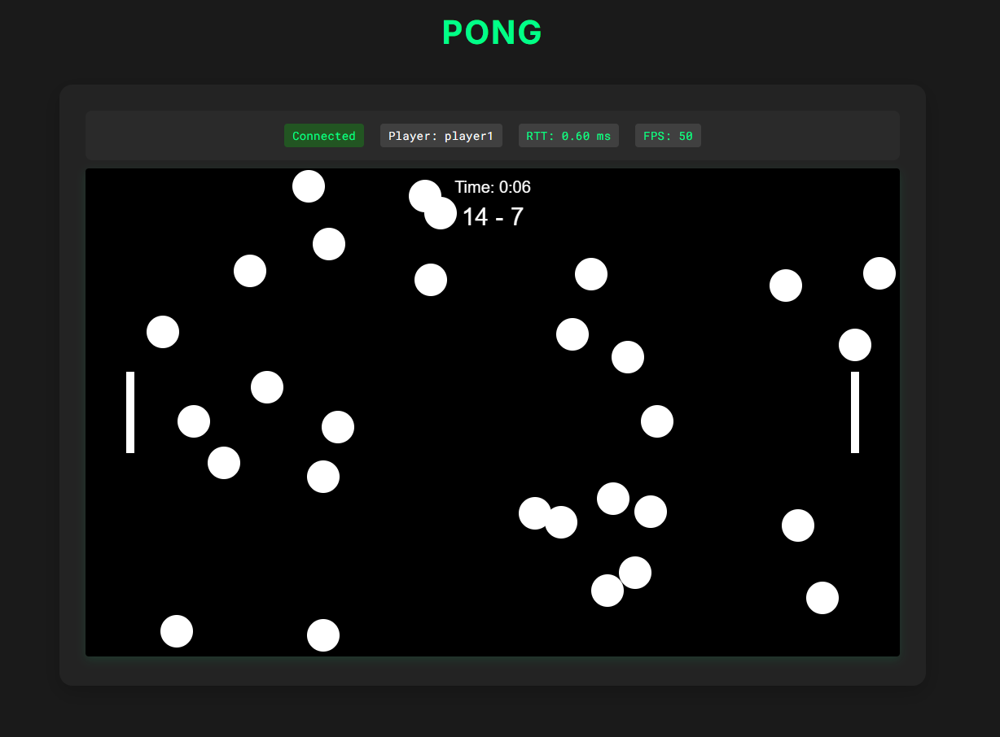

# Pong Go Web

This project is a web-based Pong game implemented using Go for the server and HTML5 Canvas for the client. The server handles WebSocket connections to manage real-time game state updates.

## Project Structure

```
pong-go-web/
│── main.go               # Entry point of the server
│── server/
│   ├── server.go         # Server initialization
│   ├── handlers.go       # WebSocket connection and event handling
│   ├── rooms.go          # Game room management
│   ├── game.go           # Game logic (physics, collisions, etc.)
│   ├── player.go         # Player structure and state
│── models/
│   ├── room.go           # Room structure definition
│   ├── player.go         # Player structure definition
│── static/
│   ├── index.html        # Web client
│   ├── game.js           # Frontend logic
│   ├── styles.css        # Client styles
│── go.mod                # Project dependencies
│── go.sum                # Dependency checksums
│── README.md             # Project overview and instructions
```

## Current State



Current implementation shows a basic two-player pong game with real-time WebSocket communication.

## Getting Started

### Prerequisites

- Docker and Docker Compose
OR
- Go 1.16 or later
- A modern web browser

### Running with Docker

1. Build and start the container:
    ```sh
    docker-compose up --build
    ```

2. Open your web browser and navigate to `http://localhost:8080`

3. To stop the server:
    ```sh
    docker-compose down
    ```

### Running without Docker

1. Install dependencies:
    ```sh
    go mod tidy
    ```

2. Start the server:
    ```sh
    go run main.go
    ```

3. Open your web browser and navigate to `http://localhost:8080`

### Playing the Game

- The first player to connect will be assigned as Player 1 (left paddle).
- The second player to connect will be assigned as Player 2 (right paddle).
- Use the arrow keys to move your paddle up and down.
- The game will keep track of the score and reset the ball when a goal is scored.

## TODO List

- [ ] Fix double collision issues when balls overlap
- [ ] Add paddle acceleration mechanics
- [ ] Implement support for multiple game rooms
- [ ] Add game mode selection and custom rules:
  - Victory by score limit
  - Victory by goal difference
  - Time-based matches
  - Multiple balls spawning
- [ ] Allow players to choose custom names

## License

This project is licensed under the MIT License. See the [LICENSE](LICENSE) file for details.
